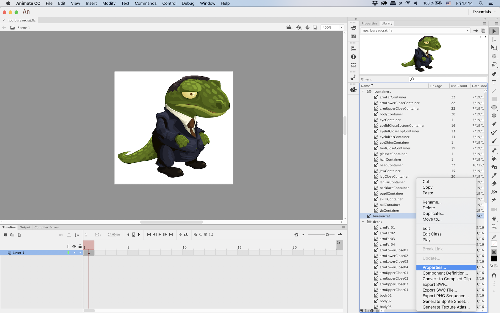
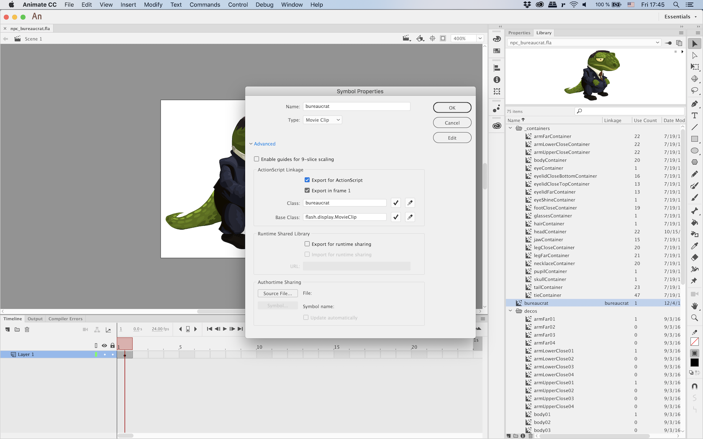
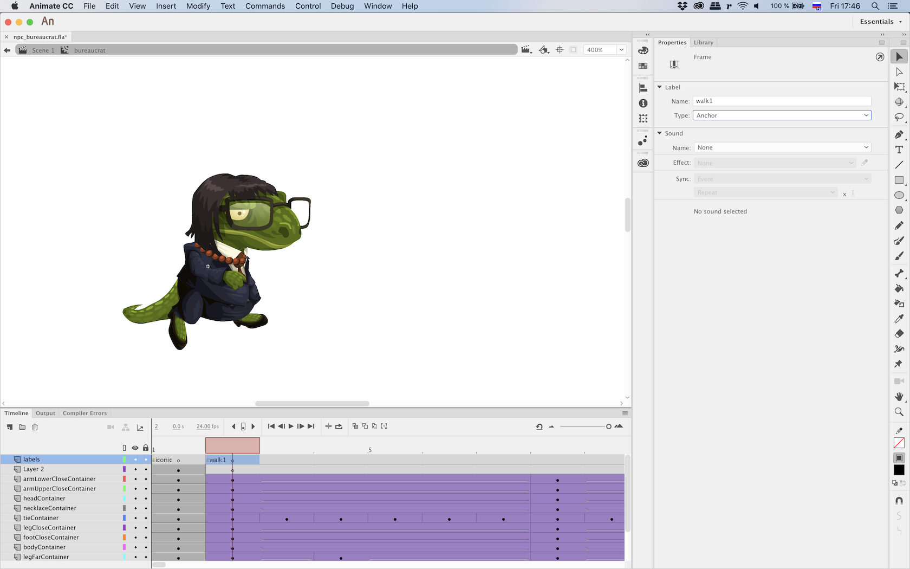
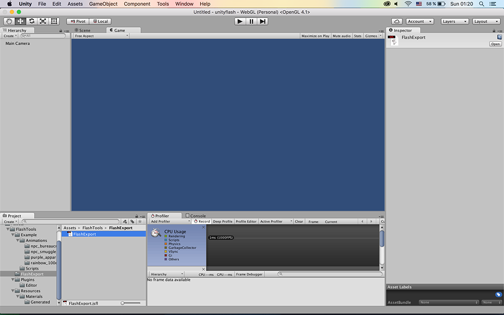
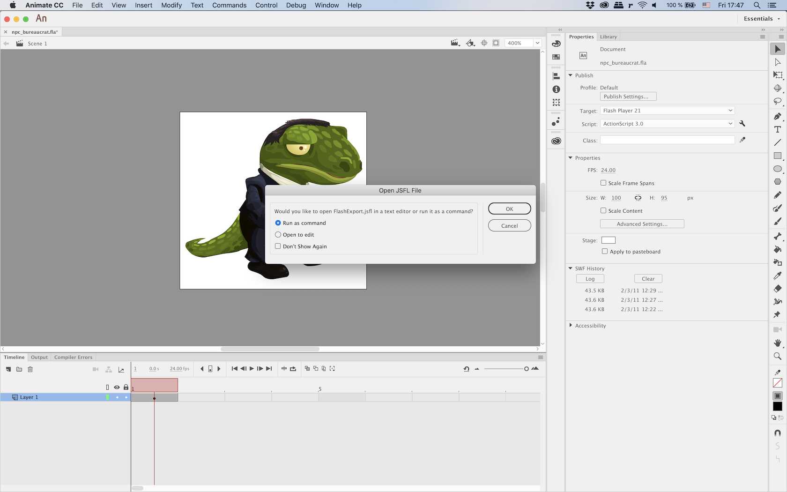
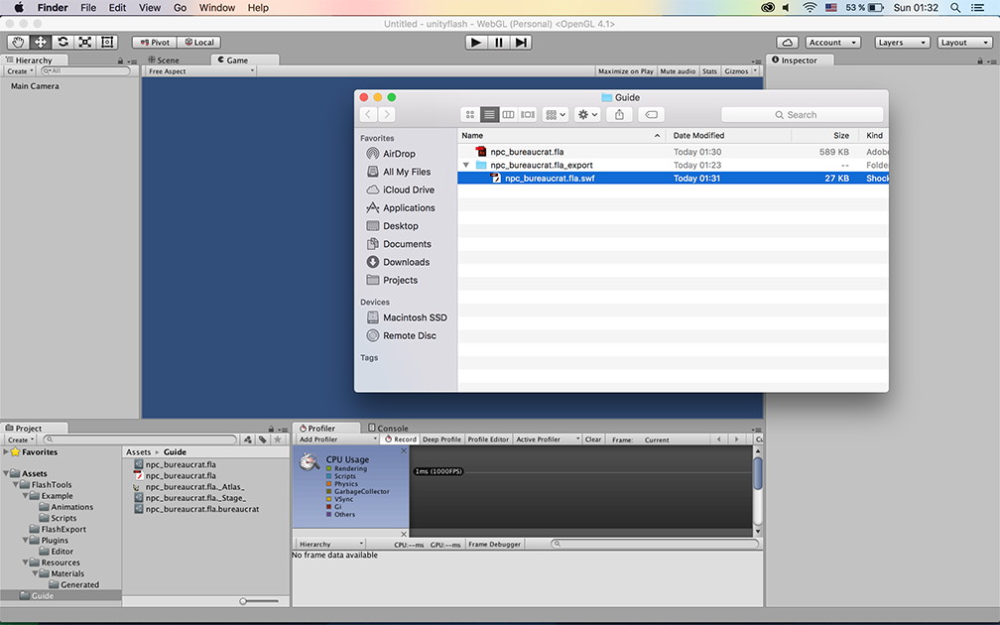
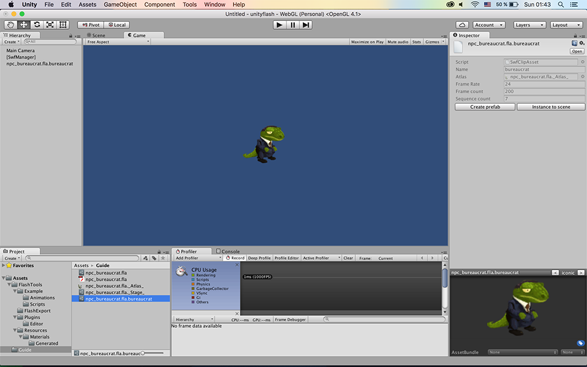
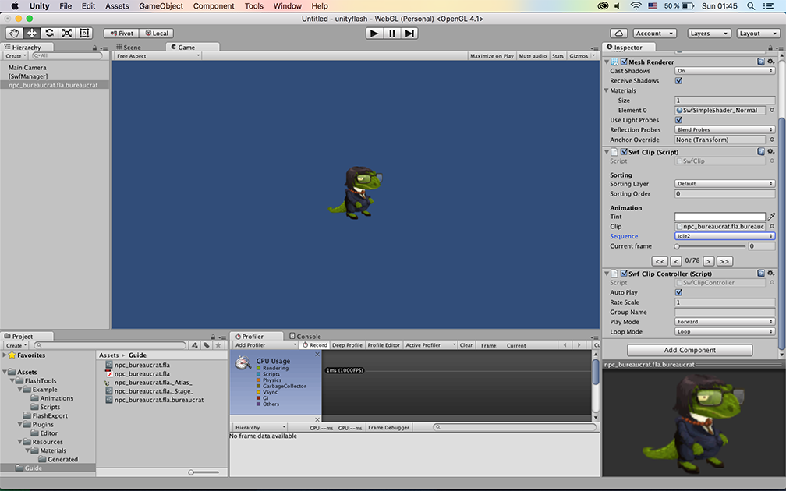

Open your flash animation in Adobe Flash (CS6 or above).

Click the right button on movie clip which you want to export besides main timeline and go to the Properties.

Choose "Export for ActionScript" and set name for clip in "Class" field.

You can add **anchor** frame labels to separate timeline to different named sequences.

Run export script (_FlashTools/FlashExport/FlashExport.jsfl_) for your flash animation. The script optimizes an animation, rasterizes vector graphics and export .swf file which is compatible with the toolset.

Move exported .swf file to your unity project (You may find this .swf file at _export folder next to .fla file).

.swf file will be automatically converted to unity asset with proper settings. Open them to change texture packing settings (by default it uses settings from _"FlashTools/Resources/SwfSettings"_).

Now you can select exported clip and add it to scene or create a prefab.

In instance properties you can change any settings like a sorting layer, play mode, current frame and etc.

Enjoy!
