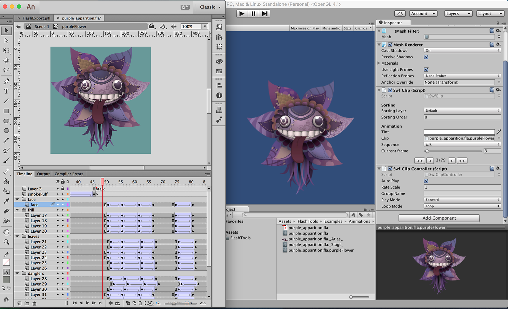
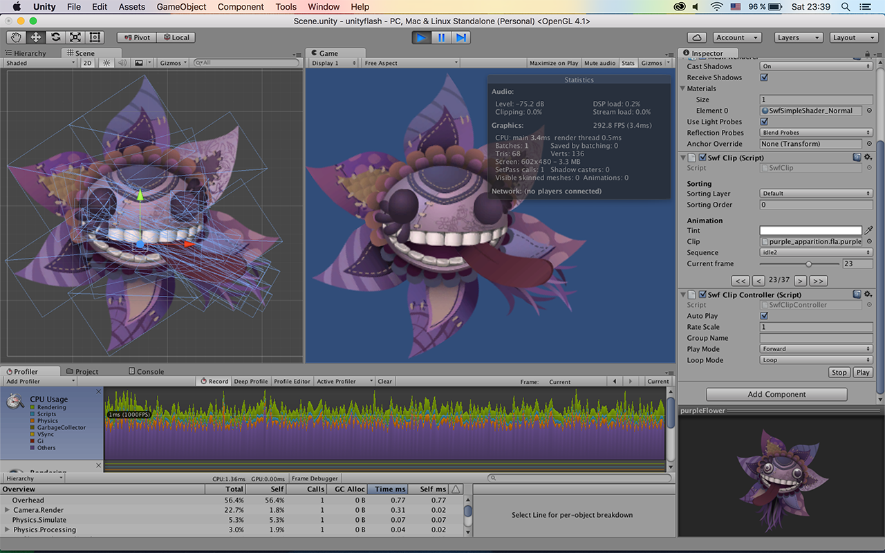

# Flash Animation Toolset

> Convert your flash animation for Unity easy!

[Trial Version](https://assetstore.unity.com/packages/tools/animation/flash-animation-toolset-trial-73896) |
[Full Version](https://assetstore.unity.com/packages/tools/animation/flash-animation-toolset-73323) |
[Forum](https://forum.unity.com/threads/1-3-15-flash-animation-toolset.440085) |
[User Guide](Assets/FlashTools/Docs/USERGUIDE.md) |
[Usage Video](http://www.youtube.com/watch?v=uE_XRWZ5KHA) |
[API Reference](Assets/FlashTools/Docs/API.md) |
[Changelog](Assets/FlashTools/Docs/CHANGELOG.md)

## Features

- Support all transformations like 'rotation', 'skew' and 'scale' (except 3D)
- Support all tweens(classic, motion and etc), keyframes and layers
- Support mask layers
- Support bitmap and vector graphics
- Support all clip color effects like 'brightness', 'tint', 'alpha' and etc
- Support most blending modes (all except Alpha and Erase)
- Simple runtime API for controlling your animations in Unity
- Automatic packing texture atlases of animations with different settings
- Great performance with zero allocations in update loop
- Frame labels to separate sequences in one timeline
- Export marked "for export" clips and main timeline
- Live preview of animations in the Unity editor

Supports Unity 2017.4 (LTS) and newer, both Personal and Pro. Full C# source code included.

Leave your rating for this Asset. It is very important for me and the development of the project :) Thank you!

## Screenshots

## [License (MIT)](./LICENSE.md)

* Samples use "Creative Commons CC0 1.0 Universal License" animations from [Glitch game](http://www.glitchthegame.com/public-domain-game-art)
